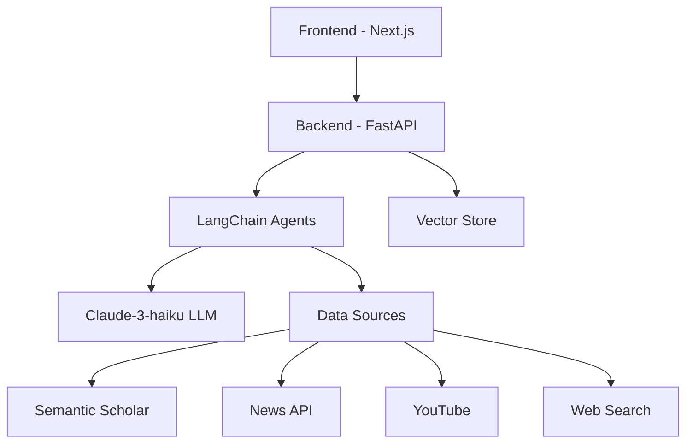

# Erudite: Advanced Knowledge Graph Generator

## 🌟 Overview

Erudite is a cutting-edge knowledge graph generation system that combines advanced LLM capabilities with multi-source document processing and semantic search. It creates dynamic, interactive knowledge graphs while providing real-time insights through an agent-based research platform.

## ✨ Key Features

- 🤖 **Intelligent Agent System**
  - Real-time streaming of agent thoughts and actions
  - Multi-source research capabilities
  - Dynamic knowledge synthesis

- 🔍 **Advanced Search & Retrieval**
  - Semantic Scholar integration
  - News article analysis
  - YouTube content processing
  - Web search capabilities

- 📊 **Knowledge Graph Generation**
  - Dynamic graph visualization
  - Interactive node exploration
  - Real-time graph expansion
  - Semantic relationship mapping

- 💫 **Modern UI/UX**
  - Real-time streaming updates
  - Interactive visualizations
  - Responsive design
  - Dark/light theme support

## 🏗 Architecture

### System Components



### Tech Stack

- **Frontend**
  - Next.js 14
  - React
  - Radix UI
  - TypeScript
  - React Flow (for graph visualization)

- **Backend**
  - FastAPI
  - LangChain
  - Claude-3-haiku
  - uvicorn
  - Pathway LLM xpacks (vector store)
  - Pathway tables (metadata store)

## 🚀 Quick Start

### Prerequisites
- Docker
- Node.js 18+ (for local development)
- Python 3.10+ (for local development)

### Running with Docker or Locally

1. **Backend**
```bash
cd backend
cp .env.example .env  # Configure your environment variables
docker build -t erudite-backend .
docker run -p 8000:8000 --env-file .env erudite-backend
```

or, to run locally,
```bash
cd backend
pip install uv
uv venv --python 3.11
source .venv/bin/activate
uv pip install -r requirements.txt
python run_pathway_server.py [KEEP THIS RUNNING IN THE BACKGROUND]
python main.py
```

2. **Frontend**
```bash
cd ui
cp env.example .env.local  # Configure your environment variables
docker build -t erudite-frontend .
docker run -p 3000:3000 erudite-frontend
```

or, to run locally,
```bash
cd ui
npm i --force
npm run dev [FOR DEVELOPMENT MODE]
npm run build && npm run start [FOR PRODUCTION MODE]
```

The application will be available at:
- Frontend: http://localhost:3000
- Backend API: http://localhost:8000

## 🏗 Project Structure

```
.
├── backend/               # FastAPI backend
│   ├── agents/           # Agent system
│   ├── pipelines/        # Data processing
│   └── services/         # External integrations
└── ui/                   # Next.js frontend
    ├── src/              # Source code
    │   ├── app/          # Next.js pages
    │   └── components/   # React components
    └── public/           # Static assets
```

## 🔧 Configuration

### Backend Environment Variables (.env)
```
ANTHROPIC_API_KEY=your_key_here
SEMANTIC_SCHOLAR_API_KEY=your_key_here
NEWS_API_KEY=your_key_here
YOUTUBE_API_KEY=your_key_here
... and so on.
```

### Frontend Environment Variables (.env.local)
```
BACKEND_URL=http://localhost:8000
GROQ_API_KEY=your_key_here
```

## 📚 Documentation

- [Backend Documentation](backend/README.md)
- [Frontend Documentation](ui/README.md)

## 📄 License

This project is licensed under the MIT License - see the [LICENSE](LICENSE) file for details.

## 🙏 Acknowledgments

- [LangChain](https://github.com/hwchase17/langchain)
- [Anthropic](https://www.anthropic.com/)
- [Next.js](https://nextjs.org/)
- [FastAPI](https://fastapi.tiangolo.com/)
- [Pathway](https://github.com/pathwaycom/pathway)